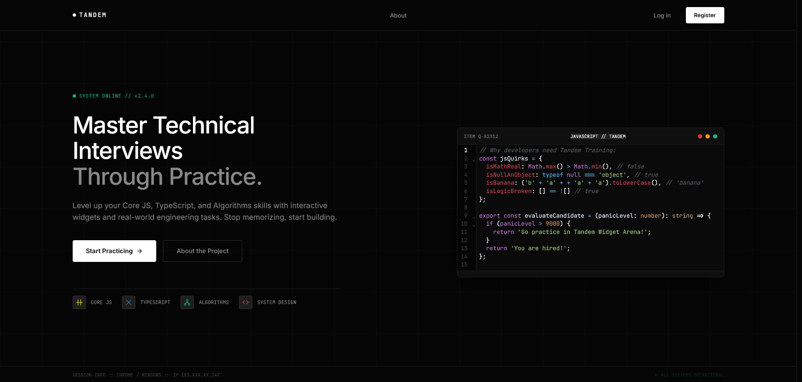

# 🚀 RS Tandem App

---

> An interactive platform for technical interview preparation. Less boring theory, more practice and confidence\!

🔗 **[Try the App (Deploy)](https://fiercesloth.github.io/rss-tandem-app)** | 🎤 **[Team Presentation](https://www.youtube.com/watch?v=yZuDaW99EvU)**

---

## 📖 About the Project

**RS Tandem App** is developed as the final project for the RS School course. Our main goal is to reshape how developers learn programming concepts and prepare for technical interviews.

Instead of classic rote memorization, we offer **educational widgets in a mini-game format**, categorized by key Frontend development topics. Users can level up their knowledge, solve algorithmic challenges, and test their code directly in the browser.

## 🏆 Awards & Recognition

We are incredibly proud to announce that **RS Tandem App** was highly distinguished at the **RS Tandem Awards 2026**.

In a field of **38 competing teams**, our project achieved a rare double win, securing awards in **2 out of the 3** primary categories:

- 🏅 **Engineering Excellence** — Awarded for our robust architectural approach, custom Vanilla TS framework, and deep technical execution.
- 🎨 **Design Excellence** — Awarded for our outstanding UI/UX, animations, and interactive widget design.

## 🛠 Tech Stack

We paid special attention to clean code and scalability, choosing a strict and modern set of tools:

- **Core:** Vanilla TypeScript, SCSS (CSS Modules)
- **Architecture:** MVC, custom `Component` base class, global event bus (`Emitter`)
- **Code Editor:** CodeMirror
- **Build Tool:** Vite
- **Code Quality:** ESLint, Prettier, Husky, Commitlint, Validate Branch Name, Vitest
- **Backend:** Supabase

> 💡 **Why Vanilla TypeScript?**
> We made a conscious decision to build this application entirely without popular UI frameworks like React or Angular. Engineering our own architecture from scratch allowed us to deeply solidify our fundamental knowledge of DOM manipulation, core TypeScript mechanics, and software design patterns.

## 👥 Our Team

One of the things we are most proud of in this project is our teamwork. Through regular calls, code reviews, and transparent task delegation, we successfully brought this complex project to release.

| Name       | Role                  | GitHub                                             | Developer Diary                                        | LinkedIn                                                            |
| :--------- | :-------------------- | :------------------------------------------------- | :----------------------------------------------------- | :------------------------------------------------------------------ |
| **Diana**  | Mentor                | [@dianakhnizova](https://github.com/dianakhnizova) | -                                                      | [LinkedIn](https://www.linkedin.com/in/diana-khnizova-9715392a2/)   |
| **Dastan** | Team Lead / Developer | [@FierceSloth](https://github.com/FierceSloth)     | 📝 [Developer Diary](./development-notes/fiercesloth/) | [LinkedIn](https://www.linkedin.com/in/dastan-hairushev-482848321/) |
| **Oleg**   | Developer             | [@coicoin](https://github.com/coicoin)             | 📝 [Developer Diary](./development-notes/coicoin/)     | [LinkedIn](https://www.linkedin.com/in/oleg-chernousov/)            |
| **Anna**   | Developer             | [@dilmun1101](https://github.com/dilmun1101)       | 📝 [Developer Diary](./development-notes/dilmun1101/)  | [LinkedIn](https://www.linkedin.com/in/anna-nitsevich-40102a405/)   |

📅 Team Meetings (Meeting Logs)

- [Meeting \#1 (Feb 10, 2026)](./development-notes/meets/2026-02-10.md)
- [Meeting \#2 (Feb 20, 2026)](./development-notes/meets/2026-02-20.md)
- [Meeting \#3 (Apr 06, 2026)](./development-notes/meets/2026-04-06.md)

## 📚 Documentation (Developer Guides)

To maintain a unified code style and architecture, we put together comprehensive internal documentation:

- 🚀 [**Local Setup**](./docs/SETUP.md) — instructions for running the project locally.
- 🔄 [**Git Flow & Collaboration**](./docs/GIT_FLOW.md) — rules for branches, PRs, and commit standards.
- 🏗️ [**Base Architecture**](./docs/BASE_COMPONENTS.md) — how our custom `Component` class and the `Emitter` event bus work.
- 🧩 [**Component Guideline**](./docs/COMPONENT_GUIDELINE.md) — standards for creating `View/Controller` entities and file structure (including the use of the `common` directory).
- 🗺️ [**Router (Navigation)**](./docs/ROUTER.md) — how our routing system and main views (like the Roadmap) are structured.
- ⚡ [**Execution Module**](./docs/EXECUTION_MODULE.md) — the architecture of our execution environment: Editor ↔ Controller ↔ Web Worker.
- 🎨 [**UI Kit**](./docs/UI_KIT.md) — a catalog of reusable interface elements.

## ✨ Featured Pull Requests

Highlighted pull requests showcasing our architectural approach:

- 🔗 [PR \#4: Base architecture initialization](https://github.com/FierceSloth/rss-tandem-app/pull/4)
- 🔗 [PR \#31: Editor and base components integration](https://github.com/FierceSloth/rss-tandem-app/pull/31)
- 🔗 [PR \#45: Execution Module implementation](https://github.com/FierceSloth/rss-tandem-app/pull/45)
- 🔗 [PR \#50: UI and routing finalization](https://github.com/FierceSloth/rss-tandem-app/pull/50)

---

_Built with ❤️ by the Strict Mode Team_
