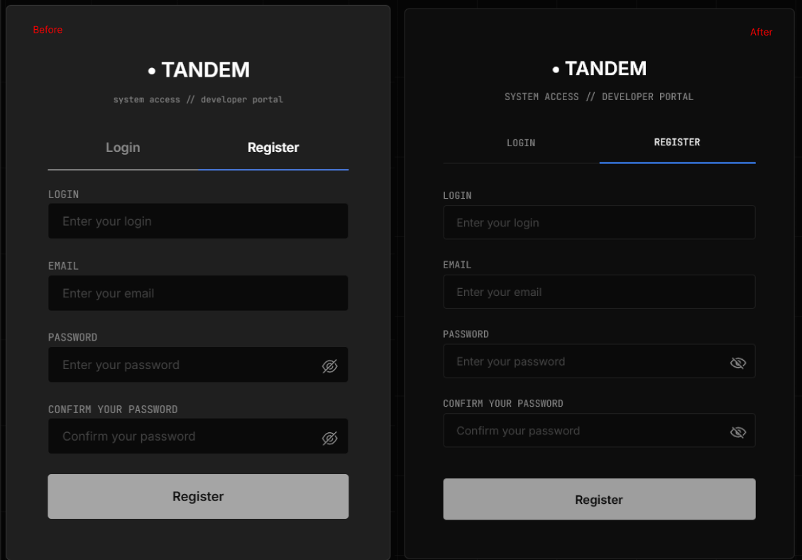

# Дата: 2026-03-20

## Что было сделано (включая 18-20 марта):

1. Провел Code Review 2 PR ов:

- Страница Quiz. [PR](https://github.com/FierceSloth/rss-tandem-app/pull/45)
- Страница Auth. [PR](https://github.com/FierceSloth/rss-tandem-app/pull/46)

2. Участвовал на командном созвоне

## Решения:

За эти 3 дня сделал только эти 3 задачи. Не было много времени, так как начались праздники.

В PR по странице авторизации написал мало комментариев, потому что вся логика была написана хорошо, но были не соответсвия по стилям и решил вместо комментариев самому исправить стили, не трогая логики. Так же добавил адаптивности под все устройства

Во время командного созвона мы обсудили следующие задачи и так же присутствовал наш ментор, давая советы. Созвон в общем затянулся на 2-3 часа.

## Планы:

Завтра думаю взять одним махом и доделать полностью страницу `CodeArena`, но не знаю на сколько это выполнимо. Но главное верстка выполнена, а осталось лишь добавить логики и интегрировать `supabase`.

## Затраченное время: 10 часа (за 3 дня)
