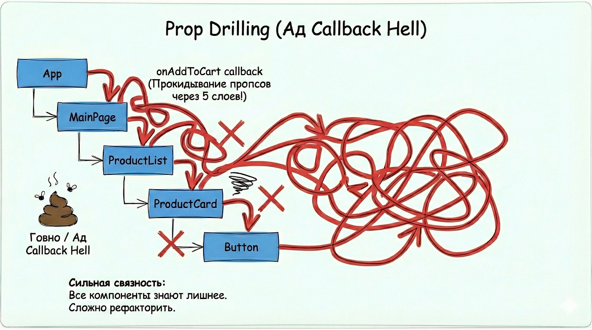
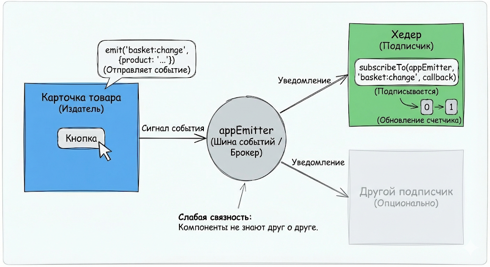

# Архитектура UI: Component и Emitter

В нашем проекте мы используем кастомную абстракцию для работы с DOM (`Component`) и паттерн Observer (`Emitter`) для общения между частями приложения. Это позволяет писать чистый код без использования тяжелых фреймворков, сохраняя при этом контроль над состоянием и памятью.

---

## 1. Component (Базовый класс UI)

Класс `Component` — это обертка над нативным HTML-элементом. Он упрощает создание тегов, управление классами, атрибутами и, самое главное, **управление жизненным циклом и очисткой памяти**.

### Зачем использовать, а не просто `document.createElement`?

1. **Цепочки вызовов (Fluent Interface):** Можно настраивать элемент в одну строчку.
2. **Безопасность памяти:** Метод `destroy()` автоматически удаляет слушатели событий и очищает ссылки, предотвращая утечки памяти в SPA.
3. **Удобная вложенность:** Можно передавать детей сразу в конструктор.

### Базовое использование

```typescript
import { Component } from './component';

// Создание простого div с классом и текстом
const card = new Component({
  tag: 'div',
  className: 'card',
  text: 'Привет, мир!',
});

// Добавление в DOM (например, в body)
document.body.append(card.node);
```

### Вложенность и Атрибуты

Конструктор принимает объект настроек первым аргументом, а все последующие аргументы — это дочерние компоненты.

```typescript
const button = new Component({
  tag: 'button',
  className: 'btn-primary',
  text: 'Нажми меня',
});

const wrapper = new Component(
  {
    tag: 'section',
    className: ['container', 'flex-row'], // Можно передать массив классов
    attrs: { id: 'main-section', 'data-role': 'wrapper' }, // Атрибуты
  },
  button // Передаем дочерний компонент
);
```

### Методы компонента

Класс предоставляет удобные методы для манипуляции элементом после создания:

- **`setText(text: string)`** — меняет текстовое содержимое.
- `addClass(className)`, `removeClass(className)` — управление CSS классами.
- **`toggleClass(className, condition?)`** — переключает класс (можно по условию).
- **`setDisabled(isDisabled)`** — удобно для кнопок и инпутов.
- **`append(...children)`** — добавляет новые дочерние компоненты.

Пример:

```typescript
button.addListener('click', () => {
  wrapper.toggleClass('active');
  button.setText('Нажато!').setDisabled(true); // Работает цепочка вызовов
});
```

### Важно: Жизненный цикл и `destroy()`

Когда компонент удаляется со страницы (например, при переходе на другую страницу роутера), **обязательно** нужно вызывать метод `destroy()`.

Он делает следующее:

1. Удаляет элемент из DOM.
2. Отписывается от всех подписок (о них ниже).
3. Рекурсивно вызывает `destroy()` для всех дочерних компонентов.

## Создание своих компонентов (Наследование)

Для сложных элементов интерфейса (Хедер, Карточка товара, Форма) мы создаем классы, наследующиеся от `Component`.

**Пример `UserCard.ts`:**

```typescript
import { Component } from './component';

export class UserCard extends Component {
  constructor(userName: string) {
    // 1. Вызываем super для настройки корневого элемента (обертки)
    super({ tag: 'article', className: 'user-card' });

    // 2. Создаем внутренние элементы
    const title = new Component({
      tag: 'h3',
      className: 'user-card__title',
      text: userName,
    });

    const btn = new Component({
      tag: 'button',
      text: 'Удалить',
    });

    // 3. Навешиваем обработчики (DOM события)
    btn.addListener('click', () => {
      this.destroy(); // Полностью удалит карточку и очистит память
      console.log('User deleted');
    });

    // 4. Собираем структуру
    this.append(title, btn);
  }
}
```

## 2. Emitter (События приложения)

`Emitter` реализует паттерн Pub/Sub (Издатель/Подписчик) или же Observer (Наблюдатель). Он позволяет компонентам общаться друг с другом, не зная о существовании друг друга. Это снижает связность кода (Loose Coupling).

У нас есть глобальный экземпляр `appEmitter`, типизированный через `AppEvents`.

### Как это работает

У emitter есть 2 основных метода это:

1. **📢 Emit (Крикнуть):** "Эй, произошло событие X!"
2. **👂 On (Услышать):** "Если произойдет событие X, я сделаю Y.".

## Почему Emitter — это удобно? (На примере Корзины)

Самый частый вопрос: _"Зачем нам Emitter, если можно просто передать функцию-колбэк?"_

Давайте разберем это на реальном примере интернет-магазина.
Представьте задачу: **Когда пользователь нажимает кнопку "Купить" в карточке товара, в шапке сайта (Header) должен обновиться счетчик товаров.**

---

### 😫 Способ 1: Без Эмиттера (Ад "Прокидывания пропсов")

Без эмиттера нам пришлось бы передавать функцию обновления счетчика из самого верха (`App`) через все промежуточные слои вниз до кнопки.

Структура приложения:
`App` -> `MainPage` -> `ProductList` -> `ProductCard` -> `Button`

**Как это выглядит в коде:**

```typescript
// App.ts
class App {
  constructor() {
    const header = new Header();

    // Нам нужно создать функцию здесь и тащить её вниз
    const handleAddToCart = () => {
      header.incrementCounter();
    };

    // Передаем в Main...
    const main = new MainPage(handleAddToCart);
  }
}

// MainPage.ts
class MainPage extends Component {
  constructor(onAddToCart: () => void) {
    // MainPage не нужна эта функция, но она обязана передать её в List
    const list = new ProductList(onAddToCart);
  }
}

// ProductList.ts
class ProductList extends Component {
  constructor(onAddToCart: () => void) {
    // List тоже просто передает её дальше...
    products.forEach((p) => new ProductCard(p, onAddToCart));
  }
}

// ProductCard.ts
class ProductCard extends Component {
  constructor(product, onAddToCart: () => void) {
    const btn = new Component({ tag: 'button', text: 'Купить' });
    // И только тут мы её вызываем!
    btn.addListener('click', () => onAddToCart());
  }
}
```



**Почему это плохо?**

1. **Жесткая связность:** `MainPage` и `ProductList` знают о логике корзины, хотя она им не нужна.
2. **Сложный рефакторинг:** Если вы захотите переместить карточку товара в другое место (например, в сайдбар), вам придется переписывать цепочку передачи функции заново.

---

## 😎 Способ 2: С использованием Emitter

С Emitter компоненты вообще не знают друг о друге. Они общаются через "эфир" (Global Event Bus).

1. Карточка просто кричит: _"Товар добавлен!"_
2. Хедер (где бы он ни находился) слышит это и обновляется.

### Шаг 1: Добавляем событие в типы

В файле `types.ts` добавляем событие изменения корзины:

```typescript
export type AppEvents = 'router:navigate' | 'basket:change'; // Новое событие
```

### Шаг 2: Карточка товара (Издатель / Emitter)

Карточке не нужно принимать никаких функций извне. Она просто отправляет событие.

```typescript
// components/ProductCard.ts
import { Component } from './base/component';
import { appEmitter } from '../emitter';

export class ProductCard extends Component {
  constructor(productName: string) {
    super({ tag: 'div', className: 'card' });

    const btn = new Component({ tag: 'button', text: 'Купить' });

    btn.addListener('click', () => {
      // 🔥 МАГИЯ ЗДЕСЬ
      // Мы просто уведомляем приложение. Нам все равно, кто это услышит.
      appEmitter.emit('basket:change', { product: productName });
    });

    this.append(btn);
  }
}
```

### Шаг 3: Хедер (Подписчик / Subscriber)

Хедер живет своей жизнью. Он просто подписывается на событие.

```typescript
// components/Header.ts
import { Component } from './base/component';
import { appEmitter } from '../emitter';

export class Header extends Component {
  private counter: Component;
  private count = 0;

  constructor() {
    super({ tag: 'header', className: 'header' });

    this.counter = new Component({ tag: 'span', text: '0' });
    this.append(this.counter);

    // ✅ ИСПОЛЬЗУЕМ subscribeTo ВМЕСТО appEmitter.on
    // Это гарантирует, что если Header удалится, подписка тоже исчезнет.
    this.subscribeTo(appEmitter, 'basket:change', () => {
      this.count++;
      this.counter.setText(this.count.toString());

      console.log('Корзина обновлена!');
    });
  }
}
```



---

## Итог: В чем выгода?

| Критерий             | Без Emitter (Callback Hell)                 | С Emitter                                     |
| -------------------- | ------------------------------------------- | --------------------------------------------- |
| **Связность кода**   | Высокая (компоненты зависят друг от друга)  | **Низкая** (компоненты независимы)            |
| **Передача данных**  | Через 5-6 файлов (Prop Drilling)            | **Напрямую** (отправитель -> получатель)      |
| **Масштабируемость** | Сложно добавлять новые фичи                 | **Легко** (любой компонент может подписаться) |
| **Чистота кода**     | Конструкторы замусорены лишними аргументами | Конструкторы чистые                           |

### Главное правило использования

Всегда используйте метод `this.subscribeTo(emitter, event, callback)` внутри классов-наследников `Component`. Это встроенный механизм защиты от утечек памяти.

Если вы напишете `appEmitter.on(...)` вручную и забудете сделать `off` при удалении компонента — приложение начнет тормозить. `subscribeTo` делает это за вас автоматически.

---

## 3. Связка Component + Emitter (Best Practices)

Самая частая ошибка в JS-приложениях — забыть отписаться от события. Если компонент удален из DOM, но функция-слушатель осталась в памяти `Emitter`, произойдет утечка памяти и возможны ошибки (попытка обновить несуществующий DOM).

Класс `Component` решает эту проблему через метод `subscribeTo`.

### ❌ Как НЕ надо делать внутри компонента:

````typescript
// Плохо: При уничтожении компонента эта функция останется висеть в памяти
appEmitter.on('router:navigate', () => {
  this.updateView();
});
````

### ✅ Как НАДО делать:

Используйте метод `subscribeTo`. Он автоматически запоминает подписку и **сам отпишется**, когда для компонента вызовут `destroy()`.

````typescript
export class Header extends Component {
  constructor() {
    super({ tag: 'header', className: 'header' });

    // Компонент подписывается на событие
    // При вызове this.destroy(), подписка удалится автоматически
    this.subscribeTo(appEmitter, 'router:navigate', (route) => {
      console.log(`Переходим на: ${route}`);
      this.highlightActiveLink(route);
    });
  }
}
````

## Резюме

1. Используйте `Component` вместо нативных методов DOM для удобства и чистоты.
2. Всегда вызывайте `destroy()` у корневого компонента страницы при её закрытии.
3. Для глобальных событий используйте `appEmitter`.
4. Внутри компонентов подписывайтесь на события только через `this.subscribeTo(...)`, чтобы избежать утечек памяти.

---

_Статью сгенерировал Gemini Pro 3 и отредактировал FierceSloth_
