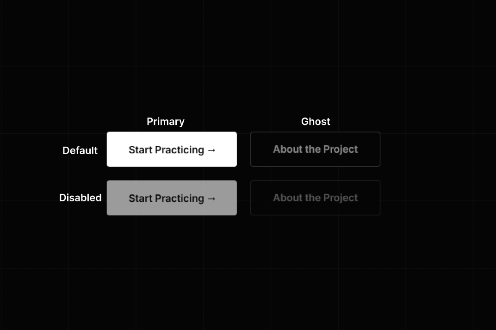
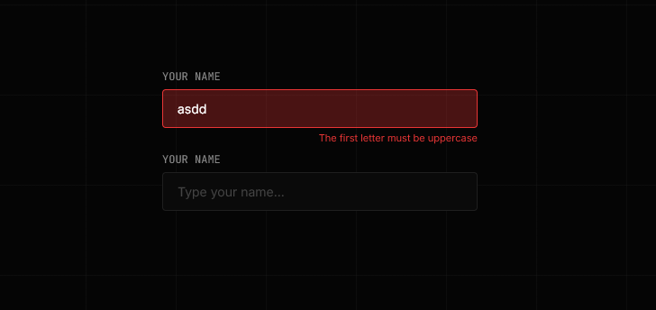
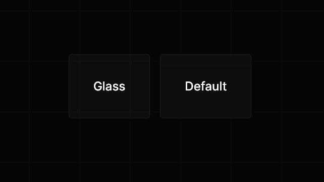
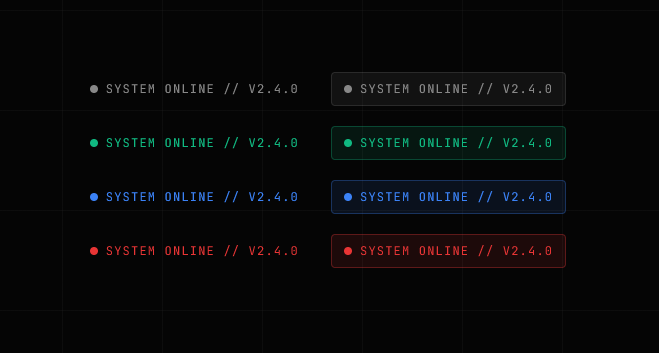
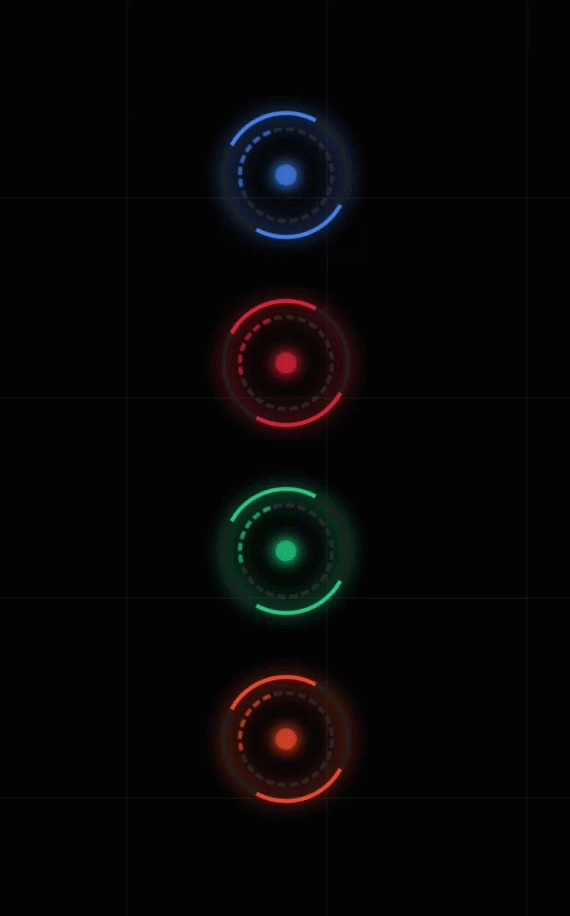
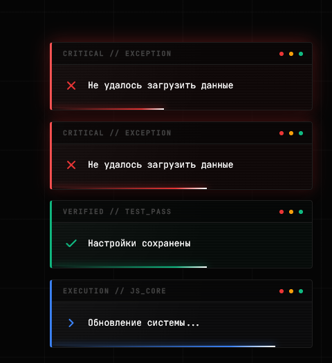

# 🎨 UI Kit & Global Components

## Навигация

- [Button](#button)
- [Input](#input)
- [Card](#card)
- [StatusBadge](#statusbadge)
- [Spinner](#spinner)
- [Toast](#toast)
- [UI Components in Notion](#ui-components-in-notion)

---

## Button

Компонент кнопки поддерживает темы и автоматическую обработку кликов.


### Варианты (Variants)

| Variant   | Описание               |
| :-------- | :--------------------- |
| `primary` | Основная (белая)       |
| `ghost`   | Контурная (прозрачная) |

### Пример использования

```typescript
import { Button } from '@/components/common/button';

const button = new Button({
  text: 'Click Me',
  variant: 'primary',
  onClick: () => console.log('Clicked!')
});

if (...) {
  button.setDisabled(true);
}

this.append(button);
```

## Input

Компонент поля ввода с поддержкой валидации, состояний ошибки и лейблов.
Ошибка отображается снизу, не смещая контент.



### Свойства (Props)

| Свойство      | Тип        | Описание                                                         |
| :------------ | :--------- | :--------------------------------------------------------------- |
| `labelText`   | `string`   | Текст заголовка над полем (необязательно)                        |
| `placeholder` | `string`   | Текст-подсказка внутри поля                                      |
| `type`        | `string`   | Тип инпута (`text`, `password`, `email` и т.д.). Default: `text` |
| `className`   | `string[]` | Дополнительные CSS классы                                        |

### Публичные методы (API)

| Метод               | Описание                                                                       |
| :------------------ | :----------------------------------------------------------------------------- |
| `getValue()`        | Возвращает текущее значение (string).                                          |
| `setValue(val)`     | Устанавливает значение программно.                                             |
| `validate(fn)`      | Запускает функцию-валидатор. Возвращает `true`/`false` и визуализирует ошибку. |
| `setError(msg)`     | Принудительно показывает ошибку с заданным текстом.                            |
| `clearError()`      | Скрывает ошибку и очищает текст сообщения.                                     |
| `setDisabled(bool)` | Блокирует (`true`) или разблокирует (`false`) поле ввода.                      |

### Пример использования

```typescript
import { Input } from '@/components/ui/input';
import { IValidateResult } from '@/common/types/types';

// 1. Создаем валидатор (чистая функция)
const emailValidator = (value: string): IValidateResult => {
  const brokenRules = [
    {
      condition: (email: string): boolean => email.length === 0,
      errorMessage: 'Email is required',
    },
    {
      condition: (email: string): boolean => !email.includes('@'),
      errorMessage: 'Invalid email format',
    },
    // ... Добавляем сколько угодно проверок
  ];

  const firstBrokenRule = brokenRules.find((rule) => rule.condition(value));

  if (firstBrokenRule) {
    return { isValid: false, errorMessage: firstBrokenRule.errorMessage };
  }

  return { isValid: true };
};

// 2. Создаем компонент
const emailInput = new Input({
  labelText: 'Email Address',
  type: 'email',
  placeholder: 'user@tandem.com',
});

// 3. Вешаем валидацию на ввод (валидация в реальном времени)
emailInput.addListener('input', () => {
  emailInput.validate(emailValidator);
});

// 4. Или проверяем при отправке формы
submitBtn.addListener('click', () => {
  const isValid = emailInput.validate(emailValidator);

  if (isValid) {
    console.log('Sending data:', emailInput.getValue());
  }
});

this.append(emailInput);
```

## Card

Универсальный контейнер для группировки контента. Поддерживает эффекты стекла (Glassmorphism), интерактивность и различные отступы.



### Свойства (Props)

| Свойство  | Тип                                      | Default  | Описание                                                |
| :-------- | :--------------------------------------- | :------- | :------------------------------------------------------ |
| `tag`     | `string`                                 | `'div'`  | HTML-тег контейнера (`section`, `article`, `li` и т.д.) |
| `padding` | `'none' \| 'sm' \| 'md' \| 'lg' \| 'hg'` | `'md'`   | Внутренние отступы                                      |
| `color`   | `'gray' \| 'green' \| 'red' \| 'blue'`   | `'gray'` | Цветовая схема карточки (меняет фон и рамку)            |
| `glass`   | `boolean`                                | `false`  | Включает эффект матового стекла (blur + transparency)   |

### Размеры Отсупов

| Отсуп  | Размер (rem) |
| :----- | :----------- |
| `none` | 0            |
| `sm`   | 1.2          |
| `md`   | 2.4          |
| `lg`   | 3.2          |
| `hg`   | 4.8          |

### Пример использования

```typescript
import { Card } from '@/components/common/card';
import { Component } from '@/components/base/component';

// 1. Создаем карточку (Контейнер)
const card = new Card({
  glass: true,       // Включаем эффект стекла
  padding: 'lg',     // Большие отступы
  className: ...
});

// 2. Создаем контент
const title = new Component({ tag: 'h2', text: 'Welcome Back' });
const text = new Component({ tag: 'p', text: 'Please sign in...' });

// 3. ОБЯЗАТЕЛЬНО: Помещаем контент внутрь карточки
card.append(title, text);

// 4. Добавляем карточку на страницу
this.append(card);
```

## StatusBadge

Индикатор статуса в терминальном стиле. Используется для отображения состояний (онлайн/оффлайн), ролей, версий или тегов технологий.

Компонент поддерживает:

- цветовые варианты
- пульсирующие анимации
- точку-индикатор
- контейнерный режим (фон + рамка)
- настройку размера индикатора



### Свойства (Props)

| Свойство        | Тип                                                                           | Default          | Описание                                            |
| :-------------- | :---------------------------------------------------------------------------- | :--------------- | :-------------------------------------------------- |
| `text`          | `string`                                                                      | —                | Текст бейджа (обязательное поле)                    |
| `color`         | `'primary' \| 'green' \| 'green-dark' \| 'blue' \| 'gray' \| 'red'`           | `'green'`        | Цвет текста и точки                                 |
| `container`     | `boolean`                                                                     | `false`          | Добавляет фон и рамку вокруг бейджа                 |
| `dot`           | `boolean`                                                                     | `true`           | Показывает круглую точку слева от текста            |
| `dotSize`       | `string`                                                                      | `8`              | Размер точки (px добавляется автоматически)         |
| `animation`     | `'none' \| 'pulse' \| 'pulse-ring' \| 'pulse-slow'`                           | `pulse-ring`     | Включает эффект пульсации (свечения) для точки      |
| `capitalize`    | `boolean`                                                                     | `true`           | Делает текст uppercase                              |

### Цветовые варианты

| Цвет       | Описание                        |
| :--------- | :------------------------------ |
| primary    | основной текстовый цвет (white) |
| green      | активный статус                 |
| green-dark | тёмный вариант успеха           |
| blue       | информационный                  |
| gray       | нейтральный                     |
| red        | ошибка / оффлайн                |

### Варианты анимации

| Animation  | Описание            |
| :--------- | :------------------ |
| pulse-ring | кольцевая пульсация |
| pulse      | мягкая пульсация    |
| pulse-slow | медленная пульсация |
| none       | без анимации        |

### Пример использования

```typescript
import { StatusBadge } from '@/components/ui/status-badge/status-badge.view';

// 1. Успешный статус с рамкой и пульсацией (по умолчанию)
const onlineStatus = new StatusBadge({
  text: 'System Online // v2.4.0',
  color: 'green',
  container: true,
});

// 2. Оффлайн статус без анимации
const offlineStatus = new StatusBadge({
  text: 'System Offline',
  color: 'gray',
  animation: 'none',
});

// 3. Простой тег без точки и рамки
const versionTag = new StatusBadge({
  text: 'Beta',
  color: 'blue',
  dot: false,
  animation: 'none',
});

// Кастомный размер индикатора 10px
const serviceStatus = new StatusBadge({
  text: 'API Connected',
  color: 'green',
  dotSize: '10',
});

this.append(onlineStatus, offlineStatus, versionTag, serviceStatus);
```

## Spinner

Анимированный индикатор загрузки (Loader) со сложной многослойной структурой (внешнее кольцо, внутреннее прерывистое кольцо и пульсирующее ядро). Поддерживает различные размеры и цветовые темы на основе CSS-переменных.



### Свойства (Props)

| Свойство  | Тип                                      | Default  | Описание                              |
| --------- | ---------------------------------------- | -------- | ------------------------------------- |
| `size`    | `'sm' \| 'md' \| 'lg'`                   | `'md'`   | Размер спиннера                       |
| `variant` | `'blue' \| 'green' \| 'red' \| 'orange'` | `'blue'` | Цветовая тема (меняет акцентный цвет) |

### Размеры

| Размер | Описание                                         |
| ------ | ------------------------------------------------ |
| `sm`   | 16x16px, идеально подходит для кнопок и инпутов  |
| `md`   | 32x32px, стандартный размер для локальных блоков |
| `lg`   | 64x64px, для полноэкранных загрузок              |

### Пример использования

```typescript
import { Spinner } from '@/components/ui/spinner/spinner.view';

// 1. Стандартный синий спиннер среднего размера
const defaultSpinner = new Spinner();

// 2. Маленький зеленый спиннер (например, внутрь кнопки)
const btnSpinner = new Spinner({ size: 'sm', variant: 'green' });

// 3. Большой красный спиннер
const errorSpinner = new Spinner({ size: 'lg', variant: 'red' });

this.append(defaultSpinner, btnSpinner, errorSpinner);
```

## Toast

Глобальный компонент всплывающих уведомлений. Уведомления автоматически выстраиваются в колонку благодаря встроенному паттерну контейнера, поддерживают анимацию скрытия и визуальный прогресс-бар оставшегося времени (лазерная полоса).



### Свойства (Props)

| Свойство   | Тип                              | Default  | Описание                                                            |
| :--------- | :------------------------------- | :------- | :------------------------------------------------------------------ |
| `message`  | `string`                         | —        | Текст уведомления (обязательное поле).                              |
| `type`     | `'success' \| 'error' \| 'info'` | `'info'` | Тип уведомления, меняющий цветовую схему, иконку и системный лейбл. |
| `duration` | `number`                         | `3000`   | Время жизни уведомления в миллисекундах (синхронизировано с UI).    |

### Варианты типов

| Тип       | Лейбл                   | Визуальный стиль                                     |
| :-------- | :---------------------- | :--------------------------------------------------- |
| `info`    | `EXECUTION // JS_CORE`  | Синий акцент, стандартная анимация появления.        |
| `success` | `VERIFIED // TEST_PASS` | Зеленый акцент, легкое свечение.                     |
| `error`   | `CRITICAL // EXCEPTION` | Красный акцент, бесконечная пульсация (error-pulse). |

### Пример использования

**Важно:** Компонент `Toast` полностью самостоятельный. Его **не нужно** добавлять в верстку через `this.append()`. При создании экземпляра класса он сам находит или создает глобальный контейнер в `document.body` и управляет своим жизненным циклом (включая удаление из DOM по истечении времени).

```typescript
import { Toast } from '@/components/ui/toast/toast.view';

// 1. Обычное информационное уведомление (исчезнет через 3 секунды)
new Toast({
  message: 'Checking system parameters...',
});

// 2. Сообщение об успешном действии
new Toast({
  message: 'Level unlocked successfully',
  type: 'success',
});

// 3. Ошибка с кастомным временем жизни (5 секунд)
new Toast({
  message: 'Failed to execute microtasks queue',
  type: 'error',
  duration: 5000,
});
```

## UI Components in Notion

**Ссылка на таблицу notion с UI компонентами**

- [UI Components Tandem](https://www.notion.so/30a7624a7163808e976bfb7d0c173f5d?v=30a7624a716380f9ae23000c2725ed97&source=copy_link)

### Структура таблицы

- **Name** - название компонента (Status Badge, Button, Module Card и т.д.)
- **Type** - тип HTML‑элемента (span, div, button и др.). Это предложенный вариант, котрый вы можете изменить на свое усмотрение
- **Data** - чекбокс, нужны ли компоненту реальные данные
- **Pages** - на каких страницах используется компонент (Landing Page, Auth Page, Quiz Round Page и т.п.)
- \*\*Status - чекбокс готовности компонента (сделан/в работе)
- **Notes** - дополнительные комментарии (что именно за часть карточки, технические метки и т.д)

### Как пользоваться фильтром по страницам?

1. Нажми сверху над колонками на вкладку `Pages` → `Contains` → `выбери нужную страницу` (например, Landing Page)
2. Таблица покажет только компоненты, которые используются на выбранной странице
3. Чтобы посмотреть другую страницу, поменяй значение в фильтре или выбери несколько страниц
4. Чтобы снова видеть все компоненты, нажми на крестик в поле (инпуте) с выбранными страницами

### Практическое использование

1. Перед работой над конкретной страницей включаешь фильтр по этой странице и видишь список всех её компонентов
2. По чекбоксу Status быстро понимаешь, какие компоненты уже готовы, а какие ещё нужно сделать
3. Через Notes можно уточнять особенности реализации (часть карточки, финальный экран и т.д.), чтобы не держать детали в голове

```

```
